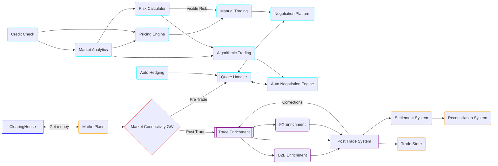

# Trading-System-for-Bonds-and-Its-Derivatives
Trading System for Bonds and Its Derivatives

```mermaid

flowchart LR;
    
    A[ClearingHouse] <-->|Get money| B(MarketPlace)
    B --> C{Market Connectivity GW}
    
    C -->|Pre Trade| E[[Quote Handler]]
    E <-->F(Negotiation Platform)
    E <-->G(Auto Negotiation Engine)
    H(Auto Hedging) --> E
    I(Manual Trading)-->F
    J(Pricing Engine) --> I
    K(Market Analytics) --> J
    L(Algorithmic Trading) --> G
    K --> M(Risk Calculator)
    M --> |Visible Risk|I
    K --> L
    M --> L
    N(Credit Check) --> K
    N --> J

    C -->|Post Trade| D[[Trade Enrichment]]
    D --> O(B2B Enrichment)
    P[Post Trade System]
    D --> Q(FX Enrichment)
    O --> P
    D --> P
    Q --> P
    P --> |Corrections|D

    P --> R(Settlement System)
    R --> S(Reconciliation System)
    P --> T(Trade Store)


    style A stroke:blue
    style B stroke:orange
    style C stroke:red

    style E stroke:cyan
    style F stroke:cyan
    style G stroke:cyan
    style H stroke:cyan
    style I stroke:cyan
    style J stroke:cyan
    style K stroke:cyan
    style L stroke:cyan
    style M stroke:cyan
    style N stroke:cyan

    style D stroke:purple
    style D stroke:purple
    style D stroke:purple
    style D stroke:purple
    style D stroke:purple

    style D stroke:purple
    style O stroke:purple
    style P stroke:purple
    style Q stroke:purple

    style R stroke:orange
    style S stroke:orange
    style T stroke:orange
    
    

```